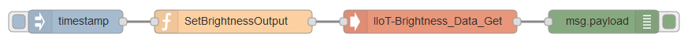
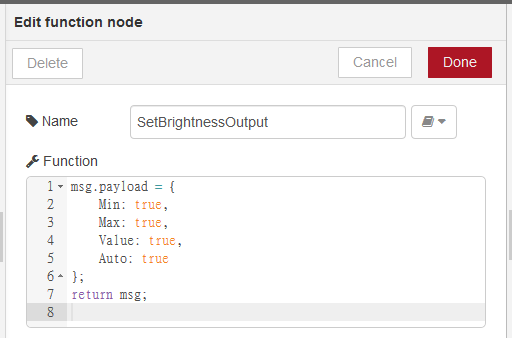
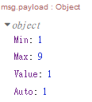
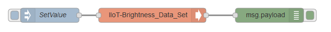
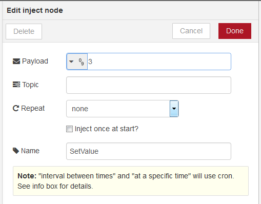
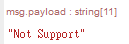
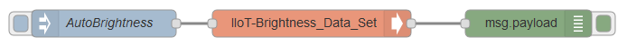
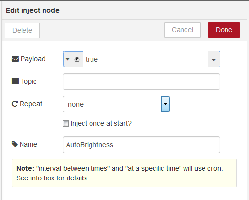

# node-red-contrib-atbrightness
A collection of [Node-RED](http://nodered.org) nodes to Configure Advantech IIoT brightness driver.

Notice that an Advantech IIoT Platform SDK have to be installed to make this node works correctly.
Advantech IIoT Platform SDK download link is shown below:
Windows:
  https://github.com/Advantech-IIoT/Platform-SDK/tree/master/windows/bin
Linux:
  https://github.com/Advantech-IIoT/Platform-SDK/tree/master/linux/bin

## Install
Use npm command to install this package locally in the Node-RED modules directory
```bash
npm install node-red-contrib-atbrightness
```
or install it globally with the command
```bash
npm install node-red-contrib-atbrightness -g
```

## Nodes included in the package
**Brightness-data-get :** Get information for devices.

**Brightness-data-set :** Set information for devices, e.g. Brightness Value.

---
## Example

### [Brightness-data-get]
Demo Flow: [Brightness_Data_Get_Demo_Flow.json](./demo/Brightness_Data_Get_Demo_Flow.json)

It will output all of the information after deployment for once.





Output is a <code>json</code> format object:

 - **Min :** Minimum Value of brightness
 - **Max :** Maximum Value of brightness
 - **Value :** Current Value of brightness
 - **Auto :** Auto Brightness Status of brightness. [0: Manual, 1: Auto].

---

If the device does not support Auto Brightness, the output object:
``` json
{
    Min: 1,
    Max: 9,
    Value: 1,
    Auto: "Not Support"
}
```

You can write following example in the function node.
It will output the same result.
```js
msg.payload = {
    Min: 1,
    Max: 1,
    Value: 1,
    Auto: 1
};
return msg;
``` 
If you just want to get specific information, eg. Current Value of brightness:
(<code>number</code> and <code>boolean</code> are valid value.)
``` js
msg.payload = {
    Value: 1
    // Or Value: true
};
return msg;
```

---
### [Brightness-data-set]
Demo Flow: [Brightness_Data_Set_Demo_Flow.json](./demo/Brightness_Data_Set_Demo_Flow.json)

This node can only receive a value for one time.

All you have to do is sending a format like <code>msg.payload</code>, type is <code>number</code> or <code>boolean</code>.

#### Set Current Brightness Value to specified value 





If you send a number is not between **<code>Minimum</code>** and **<code>Maximum</code>**, you will get <code>Not Support</code>.




#### Set Auto Brightness





You can configure the payload <code>True</code> or <code>False</code>.

---
## Tested Platform 
- Windows 10 Enterprise LTSC with node.js 18.14.1
 
## History
- 3.0.1 - June 2023 : update bundleDependencies
- 1.0.7 - October 2017 : Initial Release

## License
Copyright 2023 ADVANTECH Corp. under [the Apache 2.0 license](LICENSE).